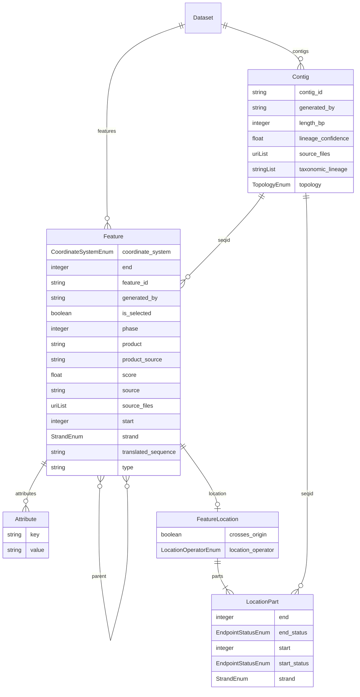

# Schema diagram

Generated 2026-09-22 from `model/schema/ber_feature_model.yaml` with `just diagram`, using
LinkML's `erdiagramgen` and the model-specific cardinality corrections in
[`scripts/schema_diagram.py`](../scripts/schema_diagram.py).
Regenerate after any schema change; this file is not auto-updated. `just check`
compares the generated Mermaid block with this committed block in CI.

`Dataset` is the tree root, added 2026-09-18 so a whole harmonized data file validates as one
instance of one class instead of a bag of loose Contig and Feature fragments. Its own box is
empty because it has no scalar slots, only the two relationships shown.

`erdiagramgen` lists every scalar and enum slot inside each entity box and draws an arrow only
for slots whose range is another class (`Contig`, `Feature`, `Attribute`). `model/schema/ber_feature_model.yaml`
itself is the source of truth if this diagram and that file ever disagree.

Each Feature references exactly one Contig, while a Contig may have zero or many
Features. Parent links are optional and many-to-many: a child can have multiple
parents, and a parent can have multiple children. Each optional FeatureLocation
contains one or more LocationParts; every part references one Contig, which may
have many parts. The wrapper preserves those inverse
cardinalities when regenerating; it fails for review if the relevant schema constraints
or upstream generator output change. It does not modify the schema.
