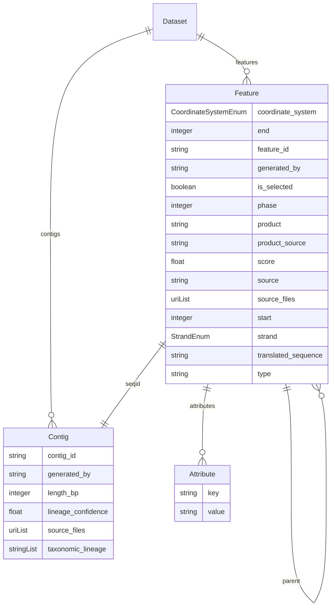

# Schema diagram

Generated 2026-09-21 from `schema/ber_feature_model.yaml` with LinkML's `erdiagramgen`
(`uv run --with linkml python3 -m linkml.generators.erdiagramgen schema/ber_feature_model.yaml -f mermaid --no-metadata`).
Regenerate after any schema change; this file is not auto-updated.

`Dataset` is the tree root, added 2026-09-18 so a whole harmonized data file validates as one
instance of one class instead of a bag of loose Contig and Feature fragments. Its own box is
empty because it has no scalar slots, only the two relationships shown.

`erdiagramgen` lists every scalar and enum slot inside each entity box and draws an arrow only
for slots whose range is another class (`Contig`, `Feature`, `Attribute`). `schema/ber_feature_model.yaml`
itself is the source of truth if this diagram and that file ever disagree.
